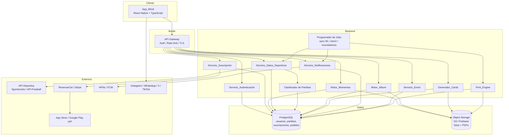
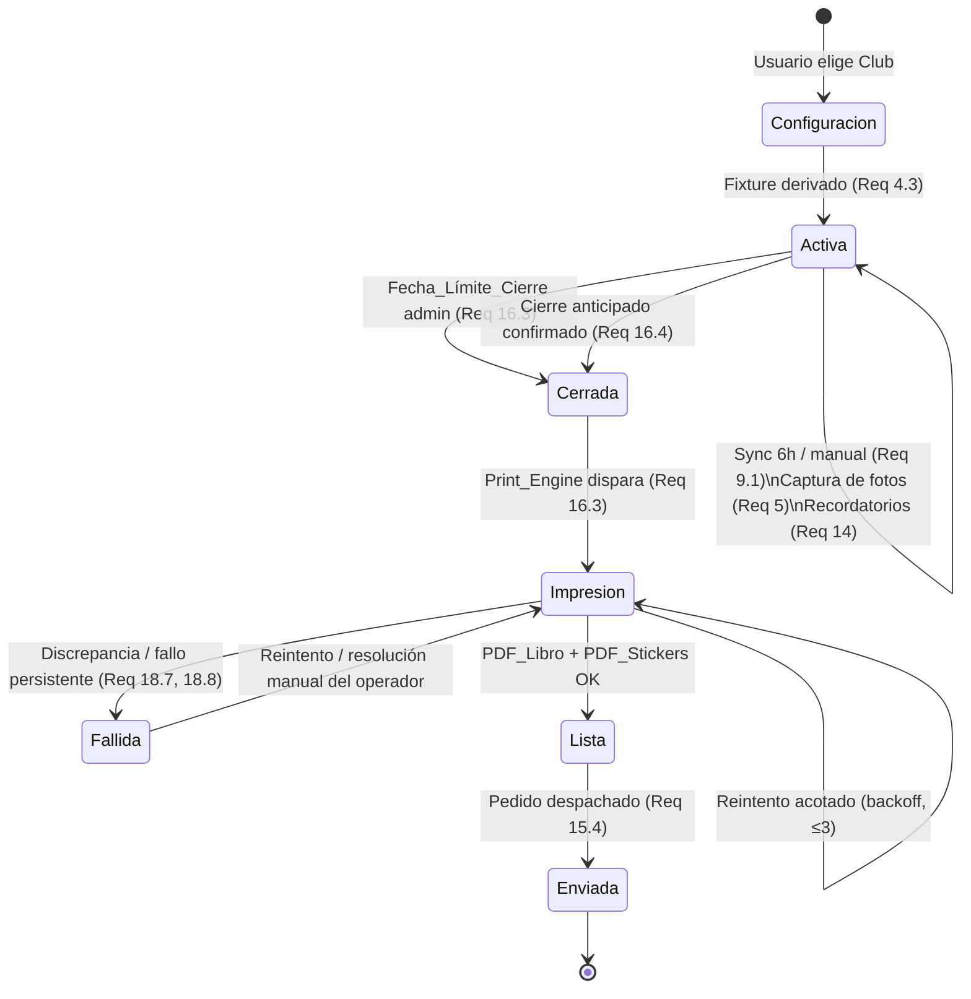
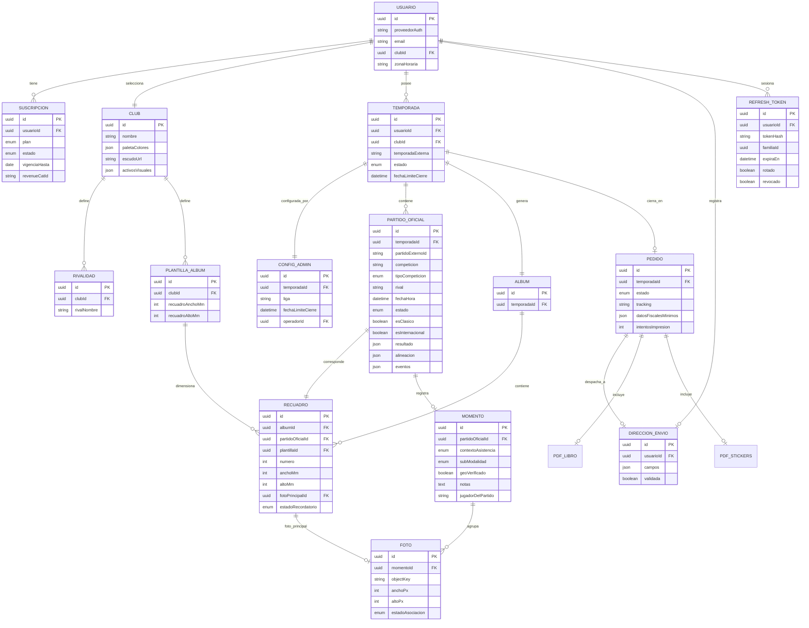

# Documento de Diseño

## Overview

Álbum de Fútbol Digital es una aplicación móvil multiplataforma (iOS 15+ / Android 8.0 API 26+) que permite a los hinchas documentar cada Partido_Oficial de la Temporada de su Club mediante fotografías, notas, contexto de asistencia y votaciones, y que al cierre de la Temporada genera automáticamente un kit de impresión (libro + planchas de stickers) listo para imprenta.

Este diseño traduce los 21 requerimientos del `requirements.md` en una arquitectura cliente-servidor orientada a servicios, con una app móvil delgada (presentación + captura) apoyada en un backend que concentra la lógica de negocio sensible a la corrección: derivación del álbum desde el fixture oficial, clasificación de partidos, reglas de gating por plan y, sobre todo, la generación de los PDFs con la correspondencia biunívoca Recuadro↔Sticker y la escala mínima de 300 DPI.

Decisiones de diseño clave y su justificación:

- **Backend como fuente de verdad del álbum y del Print_Engine** (Req 4, 16, 17, 18, 19): la estructura del álbum se deriva del fixture oficial y la impresión exige garantías estrictas (biunivocidad, DPI, aborto sin PDF parcial). Estas invariantes deben validarse en un entorno controlado y auditable, no en el cliente.
- **Numeración de stickers heredada del Recuadro y tolerante a huecos** (Req 17.4, 18.1, 18.2, 18.4): el número de cada sticker es exactamente el número de su Recuadro (que a su vez corresponde a su Partido_Oficial). Si un Recuadro queda sin Foto_Principal al cierre, no se genera su sticker; por lo tanto la numeración de stickers puede tener huecos (ej. 1, 3, 4, 7…). Esto es un resultado esperado y correcto: no se renumera de forma densa y el layout de las planchas de stickers debe tolerar numeración no contigua.
- **Fecha_Límite_Cierre como configuración administrativa** (Req 14.5, 16): la fecha de cierre no la calcula el sistema ni la fija el usuario final; la configura un operador con rol administrador por Temporada/liga. El sistema la consume para disparar el cierre automático y los recordatorios escalonados.
- **Almacenamiento de objetos separado de la base relacional** (Req 5, 19, 20): las fotos originales viven en object storage (S3 / Firebase Storage) cifradas en reposo (AES-256); PostgreSQL guarda metadatos y relaciones. Esto permite escalar el almacenamiento de imágenes de alta resolución sin penalizar la base transaccional.
- **Sincronización deportiva desacoplada mediante jobs** (Req 9): la integración con la API deportiva externa (Sportmonks / API-Football) se ejecuta en procesos en segundo plano con timeout de 30s, reintentos con backoff y sin bloquear la experiencia del usuario.
- **Gating de funciones premium centralizado** (Req 3, 12, 18): el plan del usuario, validado contra RevenueCat, se consulta en un único punto de decisión antes de generar Digital Cards internacionales y aplicar hologramas. Los webhooks de RevenueCat se procesan con verificación de firma y de forma idempotente por identificador de evento.
- **Sesión basada en JWT de acceso corto + refresh token con rotación** (Req 1, 20): el Servicio_Autenticación emite un access token de corta duración y un refresh token con expiración y rotación, evitando sesiones de larga vida en el cliente y permitiendo invalidación en logout.
- **Recordatorios anclados a la hora local del usuario** (Req 14): los recordatorios escalonados de cierre (30/15/7/1 día) y los recurrentes de Recuadro vacío se evalúan y envían respecto a la zona horaria persistida del usuario, a una hora de envío definida, no en UTC crudo.
- **Notificaciones basadas en estado, no en disparos sueltos** (Req 14): los recordatorios recurrentes y escalonados se derivan del estado persistido (Recuadro vacío / Foto_Principal asignada / recordatorio silenciado) para poder detenerse de forma determinista.
- **Cambio de Club restringido por Temporada activa** (Req 2.3): el cambio de Club solo se permite cuando no existe una Temporada en estado Activa, para no invalidar el álbum en curso derivado del fixture de ese Club.
- **Derecho al olvido (GDPR/CCPA)** (Req 20): el usuario puede solicitar el borrado de su cuenta; el Sistema elimina fotos, momentos, recuadros y datos personales, conservando únicamente el mínimo legal/fiscal asociado a los Pedidos.
- **App_Móvil en React Native (TypeScript)** (Req 22–29): el cliente móvil se implementa en React Native con TypeScript para reutilizar directamente los view-models y contratos ya construidos en `src/app` (`ClubThemeViewModel`, `CaptureViewModel`, `ShareViewModel` y las interfaces de `backend-clients.ts`). Reutilizar esa lógica TypeScript evita reescribir la capa de presentación en otro lenguaje y mantiene una única fuente de verdad de los contratos hacia el backend. La App_Móvil sigue siendo un cliente delgado: no reimplementa la lógica de negocio sensible a la corrección (biyección, gating, DPI, biunivocidad, cierre), que reside en el backend.

## Architecture

### Diagrama de arquitectura de alto nivel

### Capas y responsabilidades

1. **App_Móvil (presentación y captura)**: UI personalizada por Club (Req 2), captura/carga de fotos (Req 5), gestión de permisos GDPR/CCPA (Req 5.8, 6.3, 20.3, 20.4), previsualización renderizada (Req 11, 19.2), y publicación nativa a redes (Req 13). No contiene la lógica de impresión ni de biunivocidad.
2. **API Gateway (borde)**: termina TLS (Req 20.1), autentica peticiones con el access token (JWT) de sesión (Req 1.2), aplica límites de tasa y enruta a los servicios.
3. **Servicios de backend (lógica de negocio)**: cada componente del glosario mapea a un servicio o módulo con una responsabilidad acotada.
4. **Programador de Jobs**: dispara la sincronización periódica (Req 9.1), los recordatorios (Req 14.2, 14.6) y el cierre automático en la Fecha_Límite_Cierre (Req 16.3). Evalúa los offsets de recordatorio respecto a la zona horaria persistida de cada usuario a una hora de envío definida.
5. **Datos**: PostgreSQL para datos relacionales/transaccionales; Object Storage para binarios (fotos originales y PDFs de salida), ambos cifrados en reposo (Req 20.2).

### Roles del sistema

- **Usuario (hincha)**: consume la App_Móvil, gestiona sus momentos, fotos, suscripción y pedido. No fija la Fecha_Límite_Cierre.
- **Operador / Administrador**: rol de back-office que configura parámetros administrativos por Temporada/liga, en particular la **Fecha_Límite_Cierre** (Req 14.5, 16), y atiende las alertas de impresión fallida para resolución manual. Esta configuración no la calcula el sistema automáticamente ni la establece el usuario final.

### Flujo del ciclo de vida de la Temporada

Notas del ciclo de vida:

- La transición `Activa → Cerrada` por Fecha_Límite_Cierre usa la fecha configurada por el operador/administrador (no calculada por el sistema).
- El cambio de Club solo se permite fuera del estado `Activa` (ver Componentes: selección de Club, Req 2.3).
- Al abortar la impresión, el Print_Engine reintenta de forma automática y acotada (hasta 3 intentos con backoff). Si el fallo persiste, la Temporada/Pedido pasa a `Fallida` y se emite una alerta al operador para revisión manual, desde donde puede reintentarse o resolverse. La generación sigue siendo atómica: nunca se publica un PDF parcial.

## Arquitectura de la App_Móvil (cliente React Native)

La App_Móvil es un cliente delgado en React Native + TypeScript que consume el backend por HTTP a través del API_Gateway y reutiliza los view-models framework-agnósticos ya existentes en `src/app` (`ClubThemeViewModel`, `CaptureViewModel`, `ShareViewModel`) y sus contratos (`ClubClient`, `CaptureClient`, `CardsClient`, `NativeShareBridge` de `backend-clients.ts`). La UI de React Native se enlaza a esos view-models; la lógica de negocio sensible a la corrección (biyección, gating, DPI, biunivocidad, cierre) permanece en el backend (Req 22–29).

### Stack y librerías (propuesta)

- **React Native + TypeScript** (base): habilita reutilizar los view-models y contratos ya escritos en TypeScript sin reescribirlos.
- **Navegación**: React Navigation (stack + tabs) para el grafo de pantallas.
- **Estado/servidor**: una capa de datos con caché de peticiones (por ejemplo TanStack Query) para GET/mutaciones, más estado local ligero para sesión/tema.
- **Cliente HTTP**: fetch/axios envuelto en un módulo de red con interceptores para auth y reintentos.
- **Almacenamiento_Seguro**: Keychain (iOS) / Keystore (Android) para el Refresh_Token (Req 28).
- **IAP**: librería de compras dentro de la app (App Store / Google Play) para la compra/upgrade (Req 25).
- **Push**: APNs/FCM para el Token_Push (Req 26).
- **Compartición nativa**: adaptador que implementa `NativeShareBridge` con deep links / share sheets de Instagram Stories, WhatsApp, X y TikTok (Req 6/13 de cliente).

### Capas del cliente

El cliente se organiza en cuatro capas que reflejan el principio de cliente delgado: los view-models son framework-agnósticos y se inyectan con los adaptadores concretos, de modo que la UI no conoce detalles de red ni de APIs nativas.

1. **UI (pantallas/componentes React Native)**: renderiza estado y captura interacciones; se enlaza a los view-models sin contener lógica de negocio.
2. **View-Models (reutilizados de `src/app`, framework-agnósticos)**: `ClubThemeViewModel`, `CaptureViewModel`, `ShareViewModel` orquestan casos de uso de presentación y exponen estado observable a la UI.
3. **Adaptadores de cliente**: implementaciones concretas de `ClubClient`/`CaptureClient`/`CardsClient`/`NativeShareBridge` que hablan HTTP con el backend o con APIs nativas (share sheets, IAP, permisos). Los view-models reciben estas implementaciones por inyección de dependencias.
4. **Módulo de red**: capa transversal que gestiona auth (adjuntar Access_Token), refresh, reintentos y TLS para todos los adaptadores HTTP.

### Navegación y pantallas

Grafo principal de navegación, mapeando cada pantalla a requerimientos y endpoints:

- **Autenticación / Login** (Req 22): login multiproveedor, logout y borrado de cuenta; obtiene el par de tokens del backend.
- **Onboarding / Selección de Club** (Req 23): `PUT /usuario/club`; aplica la identidad visual del Club tras seleccionarlo.
- **Home / Álbum con previsualización** (Req 4 / Motor_Album): `GET /album/{temporadaId}/preview`; muestra Recuadros con Foto_Principal montada o silueta punteada y marca los vacíos.
- **Captura de Momento** (Req 3-cliente / 24): `POST /momentos/{partidoId}/fotos`, `PUT /recuadros/{recuadroId}/foto-principal`, `PATCH /momentos/{momentoId}` (contexto, sub-modalidad, notas, jugador del partido).
- **Detalle de Recuadro / Digital Card + Compartir** (Req 5-cliente / 6-cliente): `POST /cards` y compartición nativa a redes vía `NativeShareBridge`.
- **Suscripción** (Req 25): `GET /subscription`, compra (`purchase`), `upgrade` y `GET /entitlements`.
- **Envío / Pedido** (Req 8-cliente): `PUT /envio/direccion`, `GET /pedido/{temporadaId}`.
- **Ajustes** (Req 22): logout, borrado de cuenta, gestión de permisos y notificaciones.

### Módulo de red y sesión (Req 22, 27, 28)

- Adjunta el **Access_Token** a las peticiones autenticadas.
- Ante un `401` por expiración del Access_Token, ejecuta un **refresh single-flight** vía `POST /auth/refresh` que rota el refresh token y **reintenta la petición original**; las solicitudes concurrentes de refresh se deduplican (una sola en vuelo, las demás esperan su resultado).
- Si el refresh devuelve `401` (refresh inválido/rotado/expirado), **purga el Almacenamiento_Seguro** y enruta al login.
- **Impone TLS** y rechaza cualquier conexión no-TLS.
- Aplica **timeouts** y **reintentos acotados** solo para GET idempotentes, con backoff, sin bloquear la UI.
- **Mapea los códigos de error del backend** a manejo visible: `401` → refresh transparente o logout; `409` de conflicto de Club → mensaje explicativo; gating/plan insuficiente → mensaje "requiere Plan_Premium".

### Aplicación del Tema del Club (Req 23)

`ClubThemeViewModel` mapea la `IdentidadVisual` del Club a un `ClubTheme` (paleta, escudo, activos visuales). Un context/provider de React aplica esos colores, escudo y assets a la UI de forma consistente en todas las pantallas. El tema garantiza un contraste ≥ 4,5:1 sobre los colores del Club (Req 29).

### Permisos, IAP, Push y Compartición (Req 24, 25, 26, 6/13)

- **Permisos** (Req 24): flujo de solicitud antes de usar el recurso (cámara/galería/ubicación); al revocar el permiso cesa el uso del recurso, apoyándose en el modelo de permisos de seguridad existente.
- **IAP** (Req 25): la compra/upgrade dentro de la app envía el recibo al backend para validación y activación de derechos.
- **Push** (Req 26): registro del Token_Push (APNs/FCM) en el backend y renderizado de los recordatorios recibidos.
- **Compartición nativa** (Req 6/13): a través del adaptador que implementa `NativeShareBridge` hacia los share sheets / deep links de Instagram Stories, WhatsApp, X y TikTok.

### Estructura de carpetas propuesta (cliente)

- `app/` (proyecto React Native)
  - `src/screens/` (pantallas)
  - `src/navigation/`
  - `src/theme/` (provider de Tema_Club)
  - `src/net/` (cliente HTTP, interceptores auth/refresh)
  - `src/adapters/` (`ClubClient`/`CaptureClient`/`CardsClient`/`NativeShareBridge` HTTP + nativos)
  - `src/viewmodels/` (reutiliza/re-exporta los de `src/app`)
  - `src/storage/` (Almacenamiento_Seguro)

Los view-models framework-agnósticos existentes en `src/app` del repositorio se reutilizan directamente desde el cliente (no se reimplementan), inyectándoles los adaptadores concretos.

### Accesibilidad y compatibilidad (Req 29, 21)

- Contraste ≥ 4,5:1 en los temas de Club.
- Etiquetas de accesibilidad (accessibility labels) para lectores de pantalla.
- Soporte del escalado de fuente del sistema operativo.
- Compatibilidad con iOS 15+ y Android 8.0 (API 26+).

## Components and Interfaces

Las interfaces se expresan como contratos lógicos (endpoints REST vía API Gateway o llamadas internas entre servicios). Los tipos referencian el modelo de datos.

### Servicio_Autenticación (Req 1, 20)

Responsabilidad: registro y login multiproveedor, gestión de sesiones basadas en tokens y borrado de cuenta.

Mecanismo de sesión (tokens):

- El login emite un par de tokens: un **access token (JWT) de corta duración** (p. ej. 15 minutos) usado por el API Gateway para autenticar peticiones, y un **refresh token** con expiración más larga (p. ej. 30 días) persistido de forma segura.
- El endpoint de refresh intercambia un refresh token válido por un nuevo access token y **rota** el refresh token (rotación): el refresh token usado se invalida y se emite uno nuevo. La reutilización de un refresh token ya rotado se rechaza (indicio de robo) e invalida la familia de tokens.
- El logout invalida el refresh token vigente, cerrando la sesión.

Endpoints:

- `POST /auth/register {provider: apple|google|email, credential}` → `{ accessToken, refreshToken }`
  - Con `email` nuevo crea cuenta asociada al correo (Req 1.4).
- `POST /auth/login {provider, credential}` → `{ accessToken, refreshToken }`
  - Credenciales válidas crean sesión autenticada y devuelven el par de tokens (Req 1.2); inválidas devuelven `401` con mensaje descriptivo (Req 1.3).
- `POST /auth/refresh {refreshToken}` → `{ accessToken, refreshToken }`
  - Devuelve un nuevo access token y rota el refresh token; refresh inválido, expirado o ya rotado → `401`.
- `POST /auth/logout {refreshToken}` → `204` (invalida el refresh token).
- `DELETE /cuenta` (borrado de cuenta, derecho al olvido GDPR/CCPA, Req 20): elimina de forma permanente las fotos del object storage, los momentos, los recuadros y los datos personales del usuario, y revoca sus tokens. Conserva únicamente el mínimo legal/fiscal asociado a los Pedidos (datos de facturación/registro requeridos por ley). Ver Error Handling / Seguridad para el flujo y garantías.

### Servicio_Suscripción (Req 3)

Responsabilidad: planes, pagos IAP recurrentes, upgrades y consulta de derechos (entitlements).

- `GET /subscription` → `Suscripción` (plan actual, estado, vigencia).
- `POST /subscription/purchase {planId, receipt}` → procesa vía IAP de App Store / Google Play (Req 3.2) y activa/renueva (Req 3.3).
- `POST /subscription/upgrade {receipt}` → aplica cambio Básico→Premium tras confirmar pago (Req 3.4).
- `webhook RevenueCat` → en pago recurrente OK activa/renueva (Req 3.3); en fallo notifica y conserva estado previo (Req 3.5). El manejo del webhook:
  - **Verifica la firma** del webhook (secreto compartido / autorización de RevenueCat) y rechaza cualquier evento cuya firma no valide.
  - Es **idempotente por identificador de evento**: cada evento se procesa a lo sumo una vez; los eventos repetidos (reintentos de RevenueCat) se deduplican registrando los `eventId` ya aplicados.
  - **Tolera eventos fuera de orden**: el estado de suscripción se resuelve a partir del evento más reciente por marca de tiempo, de modo que un evento antiguo que llega tarde no revierte un estado más nuevo ya aplicado.
- `GET /entitlements` → `{ digitalCardsInternacional: bool, holograma: bool }` punto único de decisión de gating (Req 3.6, 3.7).

### Servicio de Personalización / Selección de Club (Req 2)

Responsabilidad: selección de Club y personalización visual dinámica.

- `PUT /usuario/club {clubId}` → asigna el Club del usuario y aplica su identidad visual: paleta, escudo, imágenes de estadio y camisetas (Req 2.1, 2.2).
- **Regla de cambio de Club (Req 2.3)**: el cambio de Club (asignar un `clubId` distinto al actual) **solo se permite cuando el usuario no tiene ninguna Temporada en estado `ACTIVA`**. Si existe una Temporada activa, el intento de cambio se rechaza con `409 Conflict` e informa que debe cerrarse (o no existir) la Temporada activa antes de cambiar de Club. Esto evita invalidar el álbum en curso derivado del fixture del Club actual. Cuando el cambio sí procede, el Sistema actualiza la personalización visual para reflejar el nuevo Club (Req 2.3).

### Motor_Momentos (Req 5, 6, 7, 8)

Responsabilidad: captura/registro de fotos, contexto de asistencia, notas y votación.

- `POST /momentos/{partidoId}/fotos {fuente: galeria|camara, binario}` → sube a Object Storage y asocia la foto al Momento del Partido_Oficial (Req 5.1–5.4). Permite múltiples fotos por partido (Req 5.3).
- `PUT /recuadros/{recuadroId}/foto-principal {fotoId}` → marca `fotoId` como única Foto_Principal del Recuadro (Req 5.5); solo permitido si `Temporada.estado = Activa` y antes de `Fecha_Límite_Cierre` (Req 5.7).
- `PATCH /momentos/{momentoId} {contextoAsistencia, subModalidad?, geoVerificado?, notas?, jugadorDelPartidoId?}`
  - Contexto En Vivo Local / En Vivo Visita / Transmisión (Req 6.1); geolocalización opcional en En Vivo (Req 6.2); sub-modalidad TV/Bar/Streaming en Transmisión (Req 6.4); notas (Req 7); Jugador_del_Partido desde alineación disponible (Req 8).
- Las fotos no marcadas como Foto_Principal se conservan pero se excluyen de la impresión (Req 5.6).

### Servicio_Datos_Deportivos (Req 9)

Responsabilidad: consumir la API deportiva externa, derivar fixture, enlazar fotos y disparar clasificación.

- `syncFixture(temporadaId)` (job 6h / manual, timeout 30s) → obtiene fixtures/fechas/horarios (Req 9.1); descarta solo registros inválidos y registra el motivo (Req 9.2); reintenta hasta 3 veces con backoff creciente sin bloquear al usuario (Req 9.6).
- `syncPartidoFinalizado(partidoId)` → al pasar a finalizado obtiene resultado, alineación inicial y eventos en ≤5 min (Req 9.3).
- `linkFoto(fotoId, partidoId)` → enlaza la foto con la ficha del Partido_Oficial identificado unívocamente (Req 9.4); si no hay coincidencia única, deja la foto sin enlace, la marca `PENDIENTE_ASOCIACION` y notifica (Req 9.5).

### Clasificador de Partidos (Req 10)

Responsabilidad: asignar `tipo` a cada Partido_Oficial.

- `clasificar(partido, club)` → `{ esClasico: bool, esInternacional: bool }`
  - Clásico si el rival figura en la lista predefinida de rivalidades del Club (Req 10.2).
  - Internacional si la competición de la API es internacional (Req 10.3).
  - La clasificación alimenta las reglas de holograma y Digital Cards premium (Req 10.4).

### Motor_Album (Req 11, 19.2)

Responsabilidad: previsualización del álbum coleccionable.

- `GET /album/{temporadaId}/preview` → estructura de Recuadros con Foto_Principal montada o silueta punteada para vacíos (Req 11.1, 11.2), marcando los Recuadros sin Foto_Principal (Req 11.3). Objetivo de render <2s en red móvil (Req 19.2) mediante miniaturas optimizadas.

### Generador_Cards (Req 12, 13)

Responsabilidad: crear Digital Cards y habilitar compartición.

- `POST /cards {momentoId}` → imagen con foto del usuario + marcador + escudo del Club (Req 12.1) en formato compatible (Req 12.2). Si el Momento es de Partido_Internacional y el usuario es Básico, rechaza con "requiere Plan_Premium" (Req 12.4); Premium lo permite (Req 12.3).
- Compartir: la App_Móvil ofrece Instagram Stories / WhatsApp / X / TikTok (Req 13.1) e invoca la integración nativa con la card seleccionada (Req 13.2).

### Servicio_Notificaciones (Req 14, 15.3)

Responsabilidad: recordatorios push basados en estado, anclados a la zona horaria del usuario.

- **Anclaje a hora local**: todos los recordatorios se evalúan y envían respecto a la **zona horaria persistida del usuario** (`Usuario.zonaHoraria`) a una **hora de envío definida** (p. ej. 10:00 hora local). Los offsets de cierre y la recurrencia de 24h se calculan sobre la hora local del usuario, no en UTC crudo.
- `onPartidoFinalizadoSinFoto(recuadroId)` → envía recordatorio inicial (Req 14.1) y lo reenvía aproximadamente cada 24h (a la hora local de envío) mientras el Recuadro siga vacío y no esté silenciado (Req 14.2).
- Se detiene al asignar Foto_Principal (Req 14.3) o al descartar/silenciar (Req 14.4).
- Recordatorios de cierre escalonados cuando faltan 30/15/7/1 día para la Fecha_Límite_Cierre (configurada por el operador/administrador), evaluados a la hora de envío en la zona horaria del usuario (Req 14.6).
- Notifica si falta Dirección_Envío válida al aproximarse el cierre (Req 15.3).

### Servicio_Envío (Req 15)

Responsabilidad: dirección de envío, pedido y tracking.

- `PUT /envio/direccion {direccion}` → registra/valida Dirección_Envío antes de la Fecha_Límite_Cierre (Req 15.1, 15.2).
- `GET /pedido/{temporadaId}` → estado del Pedido e información de seguimiento tras el despacho (Req 15.4).

### Print_Engine (Req 16, 17, 18, 19.1)

Responsabilidad: generación transaccional de PDF_Libro y PDF_Stickers.

- `generarKit(temporadaId, entitlements)` disparado por cierre (Req 16.3, 16.4):
  1. Escala cada Foto_Principal a ≥300 DPI (Req 19.1).
  2. Genera `PDF_Libro`: fondos del Club, estadísticas, plantillas, Recuadros numerados (Req 17.1); montaje de Foto_Principal con guías de pegado (Req 17.2); Recuadros vacíos con silueta punteada y guías numeradas (Req 17.3, 16.5); numeración correspondiente al PDF_Stickers (Req 17.4).
  3. Genera `PDF_Stickers`: un sticker numerado por cada Recuadro con Foto_Principal (Req 18.1), omitiendo los vacíos (Req 18.2); **cada sticker hereda el `numero` de su Recuadro**, por lo que la secuencia de números impresos puede tener huecos (numeración no contigua) cuando hay Recuadros vacíos, sin renumeración densa; el layout de las planchas tolera esa numeración no contigua; guías de corte/troquelado con desviación ≤0,5 mm (Req 18.3); correspondencia biunívoca (Req 18.4); holograma en Clásicos/Internacionales solo Premium (Req 18.5, 18.6).
  4. Valida biunivocidad y DPI antes de persistir; ante discrepancia, número faltante o duplicado, fallo de DPI, o cualquier fallo de procesamiento, aborta sin producir PDF parcial y notifica (Req 18.7, 18.8).
- **Recuperación de impresión fallida**: cuando la generación aborta (discrepancia de biunivocidad, fallo de DPI o fallo de procesamiento), el Print_Engine ejecuta un **reintento automático acotado** (hasta 3 intentos con backoff). Si el fallo persiste, la Temporada/Pedido pasa al estado `FALLIDA` y se emite una **alerta al operador** para revisión manual, desde donde puede reintentarse o resolverse. La generación permanece atómica en todo momento: nunca se publica un PDF parcial (Property de atomicidad; ver Correctness Properties).

## Data Models

### Entidades y reglas clave

- **Usuario**: cuenta multiproveedor (Req 1); `clubId` determina personalización (Req 2); `zonaHoraria` (IANA, p. ej. `America/Bogota`) ancla la hora local de envío de recordatorios (Req 14). El cambio de `clubId` está restringido cuando existe una Temporada `ACTIVA` (Req 2.3).
- **Refresh_Token**: token de refresco por sesión; `familiaId` agrupa la cadena de rotación, `rotado`/`revocado` permiten invalidar la reutilización y el logout (Req 1, 20). El access token (JWT) es de vida corta y no se persiste.
- **Config_Admin**: configuración administrativa por Temporada/liga fijada por un operador (`operadorId`); contiene la `fechaLimiteCierre` (Req 14.5, 16). No la calcula el sistema ni la fija el usuario final. La `Temporada.fechaLimiteCierre` refleja este valor administrativo.
- **Plantilla_Album**: define, por Club, las **dimensiones físicas del Recuadro** (`recuadroAnchoMm`, `recuadroAltoMm`) usadas para calcular de forma verificable el DPI resultante (Req 19.1).
- **Club** y **Rivalidad**: la lista de rivalidades predefinidas alimenta la clasificación de Clásicos (Req 10.2).
- **Suscripción**: `plan ∈ {BASICO, PREMIUM}`, `estado ∈ {ACTIVA, EN_GRACIA, VENCIDA}`; en fallo de pago se conserva el estado previo (Req 3.5). El estado se actualiza desde webhooks de RevenueCat verificados por firma, idempotentes por `eventId` y resueltos por marca de tiempo (tolerancia a orden).
- **Temporada**: `estado ∈ {CONFIGURACION, ACTIVA, CERRADA, IMPRESION, LISTA, ENVIADA, FALLIDA}`; `fechaLimiteCierre` (proveniente de Config_Admin) gobierna cierre (Req 16) y recordatorios (Req 14.6).
- **Partido_Oficial**: `estado ∈ {PROGRAMADO, EN_CURSO, FINALIZADO}`; `tipoCompeticion ∈ {LIGA, COPA_NACIONAL, INTERNACIONAL}` excluye amistosos (Req 4.2); `esClasico`/`esInternacional` los fija el Clasificador (Req 10).
- **Album** y **Recuadro**: exactamente un Recuadro por Partido_Oficial (Req 4.1); `numero` es la clave de correspondencia con el sticker y **cada sticker hereda este `numero`** (Req 17.4, 18.1) —los huecos en la numeración de stickers por Recuadros vacíos son válidos y esperados—; `fotoPrincipalId` a lo sumo uno (Req 5.5); `anchoMm`/`altoMm` (heredados de `Plantilla_Album` o específicos del Recuadro) fijan el tamaño físico objetivo para el cálculo de DPI (Req 19.1); `estadoRecordatorio ∈ {ACTIVO, DETENIDO_POR_FOTO, SILENCIADO}` (Req 14).
- **Momento**: contexto, notas y votación (Req 6, 7, 8); ligado 1:1 al Partido_Oficial.
- **Foto**: `anchoPx`/`altoPx` que, combinados con las dimensiones físicas del Recuadro, permiten verificar los 300 DPI como `px / (dimensión física en pulgadas)` (Req 19.1); `estadoAsociacion ∈ {ASOCIADA, PENDIENTE_ASOCIACION}` (Req 9.5); solo la Foto_Principal se imprime (Req 5.6).
- **Dirección_Envío**, **Pedido**: envío y tracking del kit físico (Req 15). `Pedido.datosFiscalesMinimos` es el conjunto mínimo legal/fiscal de facturación/registro que se conserva incluso tras un borrado de cuenta (Req 20); `intentosImpresion` cuenta los reintentos del Print_Engine antes de marcar `FALLIDA`.

## Correctness Properties

*Una propiedad es una característica o comportamiento que debe cumplirse en todas las ejecuciones válidas del sistema; esencialmente, un enunciado formal de lo que el sistema debe hacer. Las propiedades sirven de puente entre las especificaciones legibles por humanos y las garantías de corrección verificables por máquina.*

Estas propiedades se derivan del análisis de prework y consolidan criterios redundantes. Cada una está redactada con cuantificación universal ("Para todo/Para cualquier") y referencia los requerimientos que valida. Los criterios clasificados como EXAMPLE, EDGE_CASE, INTEGRATION o SMOKE se cubren en la Estrategia de Testing con pruebas unitarias, de integración o de humo, no con propiedades.

### Property 1: Fallo de pago preserva el estado de suscripción

*Para cualquier* estado de suscripción previo, cuando ocurre un fallo de pago recurrente, el estado de la suscripción permanece igual al previo y se emite una notificación al usuario.

**Validates: Requirements 3.5**

### Property 2: Derechos (entitlements) determinados exclusivamente por el plan

*Para cualquier* usuario, los derechos de generación de Digital Cards de Partidos_Internacionales y de efecto holograma están habilitados si y solo si su plan es Premium, y deshabilitados si su plan es Básico.

**Validates: Requirements 3.6, 3.7**

### Property 3: Un Recuadro por Partido_Oficial (biyección con el fixture)

*Para cualquier* fixture oficial derivado, existe exactamente un Recuadro por cada Partido_Oficial y ningún Recuadro sin Partido_Oficial asociado, de modo que la cantidad de Recuadros es igual a la cantidad de Partidos_Oficiales y la correspondencia Partido↔Recuadro es biyectiva.

**Validates: Requirements 4.1, 4.3**

### Property 4: Solo los partidos oficiales generan Recuadro

*Para cualquier* fixture que mezcle partidos de liga, copas nacionales, competiciones internacionales y amistosos, cada partido oficial (liga/copa/internacional) genera un Recuadro y ningún partido amistoso genera Recuadro.

**Validates: Requirements 4.2**

### Property 5: La re-derivación tras cambio de fixture mantiene la biyección

*Para cualquier* fixture inicial y cualquier actualización (altas o bajas de partidos oficiales), tras re-derivar el álbum se mantiene exactamente un Recuadro por Partido_Oficial vigente, y los Recuadros de partidos que persisten conservan su Foto_Principal.

**Validates: Requirements 4.4**

### Property 6: Todas las fotos cargadas quedan agrupadas en el Momento del partido

*Para cualquier* Partido_Oficial y cualquier conjunto de fotografías cargadas o capturadas para él, todas las fotografías quedan asociadas al Momento de ese Partido_Oficial y el conteo del Momento es igual a la cantidad de fotos cargadas.

**Validates: Requirements 5.3, 5.4**

### Property 7: A lo sumo una Foto_Principal por Recuadro

*Para cualquier* Recuadro y cualquier secuencia de marcados de Foto_Principal, el Recuadro tiene a lo sumo una Foto_Principal y esta coincide con la última fotografía marcada.

**Validates: Requirements 5.5**

### Property 8: Solo la Foto_Principal es imprimible

*Para cualquier* Recuadro con un conjunto de fotografías, el conjunto de fotografías que ingresa a los archivos de impresión es exactamente el que contiene únicamente la Foto_Principal (o vacío si no hay Foto_Principal).

**Validates: Requirements 5.6**

### Property 9: La edición de Foto_Principal solo se permite antes del cierre

*Para cualquier* instante y estado de Temporada, cambiar la Foto_Principal o agregar/reemplazar fotografías se permite si y solo si la Temporada está Activa y el instante es anterior a la Fecha_Límite_Cierre.

**Validates: Requirements 5.7**

### Property 10: La sub-modalidad requiere contexto Transmisión

*Para cualquier* Momento con un Contexto_Asistencia y una sub-modalidad, la sub-modalidad (Televisión/Bar/Streaming) se acepta si y solo si el Contexto_Asistencia es Transmisión.

**Validates: Requirements 6.4**

### Property 11: Round-trip de bitácora personal

*Para cualquier* texto de notas ingresado en un Momento, almacenarlo y recuperarlo devuelve el mismo contenido.

**Validates: Requirements 7.2**

### Property 12: El Jugador_del_Partido pertenece a la alineación

*Para cualquier* alineación disponible y cualquier selección de Jugador_del_Partido, la selección se acepta y persiste si y solo si el jugador figura en la alineación disponible.

**Validates: Requirements 8.1, 8.2**

### Property 13: La sincronización conserva los válidos y descarta solo los inválidos

*Para cualquier* lote de fixtures que combine registros válidos e inválidos (fecha, horario o identificador ausente o inválido), el resultado conserva exactamente los registros válidos, no contiene ningún registro inválido y registra un motivo de descarte por cada registro inválido.

**Validates: Requirements 9.2**

### Property 14: El enlace foto↔partido solo procede con coincidencia única

*Para cualquier* fotografía y su cantidad de coincidencias de partido, la foto se enlaza al partido si y solo si hay exactamente una coincidencia; con cero o múltiples coincidencias la foto queda sin enlace, marcada como PENDIENTE_ASOCIACION y se notifica al usuario.

**Validates: Requirements 9.4, 9.5**

### Property 15: La política de reintentos está acotada y no bloquea al usuario

*Para cualquier* secuencia de fallos o timeouts de la API deportiva, el número de reintentos es a lo sumo 3, los intervalos entre reintentos son crecientes (backoff) y el usuario puede continuar registrando el Momento sin bloqueo.

**Validates: Requirements 9.6**

### Property 16: Todo Partido_Oficial queda clasificado

*Para cualquier* Partido_Oficial obtenido de la API, la clasificación asigna un valor definido a `esClasico` y a `esInternacional`.

**Validates: Requirements 10.1**

### Property 17: Clásico si y solo si el rival está en la lista de rivalidades

*Para cualquier* Partido_Oficial de un Club, `esClasico` es verdadero si y solo si su rival figura en la lista predefinida de rivalidades de ese Club.

**Validates: Requirements 10.2**

### Property 18: Internacional si y solo si la competición es internacional

*Para cualquier* Partido_Oficial, `esInternacional` es verdadero si y solo si su competición corresponde a una competición internacional según la API.

**Validates: Requirements 10.3**

### Property 19: La previsualización refleja fielmente el estado de los Recuadros

*Para cualquier* álbum, cada Recuadro con Foto_Principal se previsualiza mostrando esa foto en su número correspondiente, cada Recuadro sin Foto_Principal se muestra con silueta punteada, y el conjunto de Recuadros indicados como faltantes es exactamente el conjunto de Recuadros sin Foto_Principal.

**Validates: Requirements 11.1, 11.2, 11.3, 16.2**

### Property 20: La Digital_Card contiene los elementos requeridos

*Para cualquier* Momento válido con Foto_Principal, marcador y Club, la Digital_Card generada incluye la fotografía del usuario, el marcador del partido y el escudo del Club.

**Validates: Requirements 12.1**

### Property 21: Gating de Digital Cards de Partidos_Internacionales

*Para cualquier* Momento de un Partido_Internacional, la generación de la Digital_Card se permite si y solo si el usuario tiene Plan_Premium; con Plan_Básico se rechaza informando que requiere Plan_Premium.

**Validates: Requirements 12.3, 12.4**

### Property 22: Recordatorio recurrente de Recuadro con condiciones de paro

*Para cualquier* línea temporal posterior a la finalización de un Partido_Oficial, se emite un recordatorio push cada 24 horas mientras el Recuadro permanezca sin Foto_Principal y el recordatorio no haya sido silenciado ni descartado; el recordatorio deja de emitirse a partir del momento en que se asigna una Foto_Principal o se silencia/descarta.

**Validates: Requirements 14.1, 14.2, 14.3, 14.4**

### Property 23: Recordatorios de cierre en los offsets exactos (hora local del usuario)

*Para cualquier* Fecha_Límite_Cierre y cualquier zona horaria del usuario, evaluando a la hora de envío definida en la hora local del usuario, se emite un recordatorio de cierre exactamente cuando faltan 30, 15, 7 y 1 día, y no en otros offsets.

**Validates: Requirements 14.6**

### Property 24: Montaje o silueta según presencia de Foto_Principal en el PDF_Libro

*Para cualquier* álbum, en el PDF_Libro cada Recuadro con Foto_Principal monta esa foto con sus guías de pegado numeradas y cada Recuadro sin Foto_Principal se representa con silueta punteada y sus guías numeradas, conservando su número.

**Validates: Requirements 17.2, 17.3, 16.5**

### Property 25: Correspondencia biunívoca "Recuadros con Foto_Principal" ↔ stickers generados

*Para cualquier* álbum al cierre, existe una biyección entre el conjunto de **Recuadros con Foto_Principal** y el conjunto de **stickers generados** en el PDF_Stickers, tal que: cada sticker lleva exactamente el `numero` de su Recuadro (numeración heredada, posiblemente **no contigua**, sin renumeración densa); la cantidad de stickers es igual a la cantidad de Recuadros con Foto_Principal; ningún número aparece duplicado; y no se genera ningún sticker para Recuadros sin Foto_Principal (los huecos en la secuencia de números son válidos y esperados, no representan números faltantes de la biyección).

**Validates: Requirements 17.4, 18.1, 18.2, 18.4**

### Property 26: Tolerancia de troquelado ≤ 0,5 mm

*Para cualquier* sticker del PDF_Stickers, la desviación entre la posición de sus guías de corte/troquelado y su posición nominal es menor o igual a 0,5 mm.

**Validates: Requirements 18.3**

### Property 27: Efecto holograma por plan y clasificación

*Para cualquier* sticker de un Recuadro clasificado como Clásico o Partido_Internacional, el efecto holograma se aplica si y solo si el usuario tiene Plan_Premium; los stickers de Recuadros no clasificados como Clásico ni Internacional nunca llevan holograma.

**Validates: Requirements 18.5, 18.6**

### Property 28: Atomicidad de la generación de PDF (nunca un PDF parcial)

*Para cualquier* discrepancia de correspondencia (conteo distinto, número faltante o duplicado) o cualquier fallo durante el procesamiento, el Print_Engine aborta la generación, no persiste ningún PDF parcial o incompleto y notifica al usuario un mensaje de error que indica la discrepancia o el fallo.

**Validates: Requirements 18.7, 18.8**

### Property 29: Escala mínima de 300 DPI para imprenta

*Para cualquier* fotografía procesada para envío a imprenta y cualquier tamaño físico objetivo del Recuadro (`anchoMm`/`altoMm` de la Plantilla_Album o del Recuadro), el DPI resultante, calculado como píxeles dividido por la dimensión física en pulgadas (`px / (mm / 25,4)`), es mayor o igual a 300 en ambas dimensiones.

**Validates: Requirements 19.1**

### Property 30: Cambio de Club bloqueado con Temporada Activa

*Para cualquier* usuario y cualquier Club destino, un intento de cambiar de Club se acepta si y solo si el usuario no tiene ninguna Temporada en estado Activa; si existe una Temporada Activa, el cambio se rechaza y el Club del usuario permanece sin cambios.

**Validates: Requirements 2.3**

### Property 31: El borrado de cuenta elimina todo dato personal salvo el mínimo legal/fiscal

*Para cualquier* solicitud de borrado de cuenta, una vez completada no queda ninguna foto, momento, recuadro ni dato personal del usuario en el sistema, conservándose únicamente el mínimo legal/fiscal asociado a sus Pedidos (datos de facturación/registro requeridos por ley).

**Validates: Requirements 20**

## Error Handling

### Autenticación y sesión (Req 1, 20)
- Credenciales inválidas: respuesta `401` con mensaje descriptivo sin filtrar detalles internos (Req 1.3).
- Access token (JWT) expirado: `401`; la App_Móvil usa el **refresh token** contra `POST /auth/refresh` para obtener un nuevo access token de forma transparente, sin reiniciar el login.
- Refresh token expirado, inválido o ya rotado: `401`; se invalida la familia de tokens (posible reutilización/robo) y la App_Móvil reinicia el flujo de login.
- Logout: invalida el refresh token vigente; los access tokens de vida corta expiran por sí mismos.

### Suscripción y pagos (Req 3)
- Fallo de pago recurrente: se conserva el estado previo (Property 1), se marca `EN_GRACIA` si aplica y se notifica; no se degradan derechos hasta agotar la gracia (Req 3.5).
- Recibo IAP inválido: la compra no se aplica y se informa al usuario; se reintenta la validación con RevenueCat.
- Webhook de RevenueCat: se **verifica la firma** y se rechaza (sin efecto) cualquier evento no verificado. El procesamiento es **idempotente por `eventId`** (los reintentos/duplicados no reaplican el cambio) y **tolerante a eventos fuera de orden** (un evento antiguo que llega tarde no revierte un estado más nuevo, resolviendo por marca de tiempo).

### Datos deportivos (Req 9)
- Registros de fixture inválidos: se descartan individualmente conservando los válidos y registrando el motivo (Property 13, Req 9.2).
- Timeout (>30s) o error de la API: log del error, hasta 3 reintentos con backoff creciente, sin bloquear al usuario (Property 15, Req 9.6).
- Enlace ambiguo o inexistente foto↔partido: foto en `PENDIENTE_ASOCIACION` y notificación; nunca se enlaza por adivinación (Property 14, Req 9.5).

### Permisos del dispositivo (Req 5.8, 6.3, 20.3, 20.4)
- Permiso faltante: la App_Móvil solicita el permiso antes de usar cámara/almacenamiento/geolocalización.
- Permiso denegado: la operación se cancela con mensaje claro; funciones dependientes quedan deshabilitadas.
- Permiso revocado: cese inmediato de uso del recurso asociado (Req 20.4).

### Envío del kit (Req 15)
- Dirección inválida o ausente al aproximarse el cierre: notificación para registrar una Dirección_Envío válida (Req 15.3); el Pedido no se despacha sin dirección validada.

### Print_Engine (Req 16, 17, 18)
- Discrepancia de biunivocidad, fallo de DPI o fallo de procesamiento: aborto atómico, sin PDF parcial, con notificación de error (Property 28, Req 18.7, 18.8). La generación se ejecuta contra almacenamiento temporal y solo se publica el resultado si ambas validaciones (biunivocidad y DPI) pasan.
- **Recuperación de impresión fallida**: tras un aborto, el Print_Engine realiza un **reintento automático acotado** (hasta 3 intentos con backoff creciente; `Pedido.intentosImpresion` lleva la cuenta). Si el fallo persiste tras agotar los reintentos, la Temporada/Pedido pasa al estado `FALLIDA` y se emite una **alerta al operador** para revisión manual, desde donde puede relanzarse la generación o resolverse el problema (transición `FALLIDA → Impresion`). La atomicidad se mantiene en todos los intentos: nunca se publica un PDF parcial (Property 28 se conserva).
- Recuadros vacíos al cierre: no son un error; se imprimen con silueta y se omite su sticker; la numeración de stickers resultante puede quedar no contigua, lo cual es válido (Req 16.5, 17.3, 18.2; Property 25).

### Selección de Club (Req 2.3)
- Intento de cambio de Club con una Temporada `ACTIVA`: se rechaza con `409 Conflict` e informa que debe cerrarse (o no existir) la Temporada activa antes de cambiar de Club; el `clubId` del usuario permanece sin cambios (Property 30).

### Seguridad y privacidad (Req 20)
- Toda comunicación se rechaza si no viaja sobre TLS (Req 20.1). Los objetos en reposo se cifran con AES-256 (Req 20.2); una lectura sin descifrado válido falla de forma segura.
- **Borrado de cuenta (derecho al olvido, GDPR/CCPA)**: el flujo `DELETE /cuenta` elimina de forma permanente las fotos (object storage), momentos, recuadros y datos personales del usuario, y revoca todos sus refresh tokens. Se conserva únicamente el `Pedido.datosFiscalesMinimos` (facturación/registro requeridos por ley). El borrado se ejecuta de forma idempotente (una solicitud repetida sobre una cuenta ya borrada no falla ni deja residuos) y, ante fallo parcial, se reintenta hasta dejar el sistema en el estado objetivo, garantizando la ausencia total de datos personales salvo el mínimo legal/fiscal (Property 31).

## Testing Strategy

### Enfoque dual
Se combinan pruebas basadas en propiedades (para las invariantes universales de la sección Correctness Properties) y pruebas por ejemplo/edge/integración/humo (para el resto de criterios). Las propiedades cubren la lógica de negocio pura y verificable; las pruebas de integración y humo cubren dependencias externas y configuración.

### Property-Based Testing (PBT)
- **Aplicabilidad**: PBT aplica a la lógica pura del backend: derivación del álbum desde el fixture, clasificación de partidos, gating por plan, política de reintentos, validaciones de contexto/alineación, la regla de bloqueo de cambio de Club por Temporada Activa, el cálculo de offsets de recordatorio en hora local del usuario, el borrado de cuenta (estado resultante), y —de forma central— la biunivocidad "Recuadros con Foto_Principal"↔stickers (con numeración no contigua), la escala a 300 DPI calculada sobre dimensiones físicas y la atomicidad del Print_Engine. El motor de I/O (API deportiva, IAP, webhooks, PDFs binarios en disco, push, borrado en object storage) se aísla con mocks para permitir 100+ iteraciones a bajo costo.
- **Librería**: usar una librería de PBT del lenguaje objetivo del backend, sin implementar PBT desde cero. Ejemplos según stack: `fast-check` (Node.js/TypeScript) o `Hypothesis` (Python/FastAPI). No implementar generadores/reducción manualmente.
- **Iteraciones**: mínimo 100 iteraciones por test de propiedad.
- **Trazabilidad**: cada test de propiedad se etiqueta con un comentario con el formato:
  `Feature: digital-football-album, Property {number}: {property_text}`
- **Cobertura**: implementar cada propiedad (Property 1–31) con un único test de propiedad. Los generadores deben cubrir explícitamente edge cases relevantes: fixtures con amistosos y campos inválidos (Property 4, 13), álbumes con 0/N recuadros y con/sin Foto_Principal, incluyendo subconjuntos que produzcan numeración de stickers **no contigua** (Property 25), fotos de dimensiones extremas combinadas con distintas dimensiones físicas de Recuadro/Plantilla para el cálculo `px / pulgadas` de 300 DPI (Property 29), clasificaciones mixtas para holograma (Property 27), usuarios con Temporadas en todos los estados (incluida Activa) para el bloqueo de cambio de Club (Property 30), zonas horarias diversas para los offsets locales de recordatorio (Property 23), y estados de usuario con múltiples fotos/momentos/recuadros y Pedidos para el borrado de cuenta (Property 31).

### Pruebas por ejemplo (unit) y edge cases
Cubren los criterios EXAMPLE/EDGE_CASE del prework:
- Autenticación: login válido (1.2), registro por email (1.4), credenciales inválidas (1.3), solicitud de permisos (5.8, 6.3, 20.3, 20.4).
- Suscripción: catálogo de planes (3.1), webhook de pago OK (3.3), upgrade (3.4).
- Momentos/UI: carga desde galería (5.1), captura (5.2), marcado de contexto (6.1), geolocalización opcional (6.2), ingreso de notas (7.1).
- Envío: registro y validación de dirección (15.1, 15.2), notificación por dirección faltante (15.3).
- Cierre: confirmación anticipada (16.1), disparo automático/anticipado (16.3, 16.4).
- Revocación de permiso: cese de uso del recurso (20.4).

### Pruebas de snapshot / render
- Tema visual por Club: aplicación de paleta/escudo/activos al seleccionar y al actualizar el Club (2.1, 2.2, y la actualización visual de 2.3). La regla de negocio de 2.3 (bloqueo del cambio con Temporada Activa) se cubre por la Property 30, no por snapshot.
- Secciones del PDF_Libro: fondos, estadísticas, plantillas, recuadros numerados (17.1).
- Formato compatible de Digital_Card (12.2).

### Pruebas de integración
Cubren dependencias externas con 1–3 ejemplos representativos, no PBT:
- IAP de App Store/Google Play (3.2) con sandbox/mock.
- Webhook de RevenueCat: verificación de firma, deduplicación por `eventId` y tolerancia a eventos fuera de orden (3.3, 3.5) con eventos simulados.
- Ciclo de tokens: login → refresh (rotación) → logout, y rechazo de reutilización de refresh token (1.2).
- Sincronización deportiva con timeout de 30s (9.1) y obtención post-finalización ≤5 min (9.3) contra la API mockeada.
- Compartir nativo a Instagram/WhatsApp/X/TikTok (13.2).
- Estado del Pedido y tracking del proveedor logístico (15.4).
- Recuperación de impresión fallida: reintento acotado, transición a `FALLIDA` y alerta al operador tras agotar reintentos (18.7, 18.8) con el motor de PDF mockeado.
- Borrado de cuenta extremo a extremo: eliminación efectiva de binarios en object storage y revocación de tokens, conservando el mínimo fiscal (20).
- Rendimiento de previsualización <2s en red móvil simulada (19.2).

### Pruebas de humo (smoke) y compatibilidad
- Catálogo configurado y Fecha_Límite_Cierre fijada por el operador/administrador vía Config_Admin por Temporada/liga (14.5), TLS habilitado (20.1), cifrado en reposo AES-256 (20.2).
- Ejecución en iOS 15+ (21.1) y Android 8.0 API 26+ (21.2) sobre dispositivos/emuladores de referencia.

### Pruebas del cliente móvil (React Native)
Cubren la App_Móvil (Req 22–29):
- **Pruebas unitarias** de los view-models reutilizados (ya existentes) y de los adaptadores de cliente (`ClubClient`/`CaptureClient`/`CardsClient`/`NativeShareBridge`) contra un backend HTTP mockeado.
- **Pruebas del módulo de red**: `401` → refresh transparente con rotación y reintento de la petición original, single-flight de refresh concurrente, refresh `401` → logout, rechazo de conexiones no-TLS, timeout con reintento acotado sin bloquear la UI (Req 22, 27, 28).
- **Pruebas de UI/componentes**: aplicación del Tema_Club y contraste, estados montada/silueta/faltantes de la previsualización, mensajes de gating "requiere Plan_Premium" y de conflicto `409` de Club (Req 23, 27, 29).
- **Pruebas de flujo/e2e** (Detox o similar) en emuladores iOS 15+ / Android 8.0+: login, selección de Club, captura + Foto_Principal + contexto, compartir nativo, compra/upgrade IAP en sandbox, y registro de Token_Push (Req 22–26, 21).
- **Almacenamiento seguro**: Refresh_Token en Keychain/Keystore y su borrado al cerrar sesión o borrar la cuenta (Req 28).
